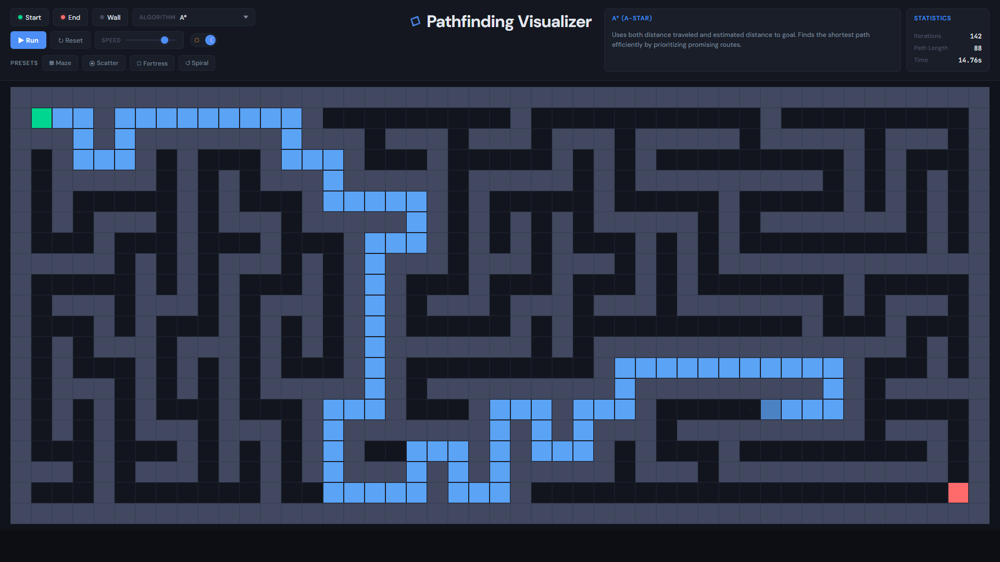
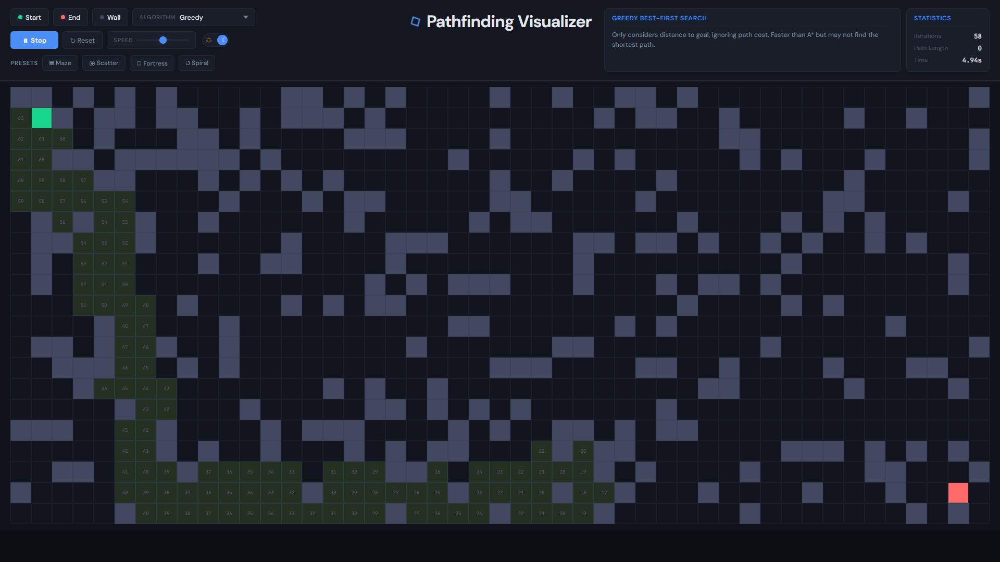
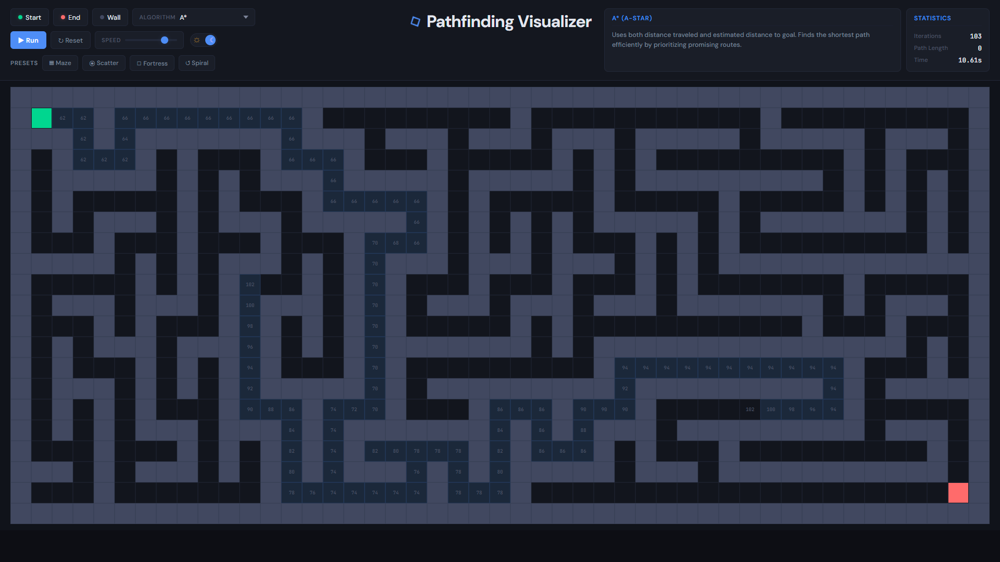
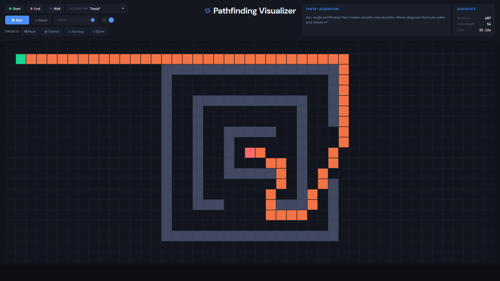
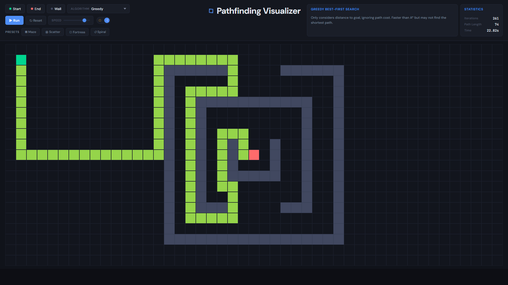

# Pathfinding Visualizer

> An interactive, browser-based tool for visualizing and comparing classic pathfinding algorithms on a live grid.

Draw walls, place a start and end node, choose an algorithm, and watch it search in real time — then see the shortest path traced back. Built with React and Vite, with zero backend required.

---

## Live Demo

> _Deploy to GitHub Pages and replace this line with your URL._

---

## Screenshots

| A\* on open grid | A\* through a maze | Greedy search |
|---|---|---|
|  |  |  |

| Algorithm running | Theta\* spiral | Greedy spiral |
|---|---|---|
|  |  |  |

---

## Features

- **10 algorithms** — each with real-time step-by-step visualization
- **Click and drag** to draw or erase walls; right-click to erase
- **Place start & end nodes** anywhere on the grid
- **Adjustable speed** — from slow step-through to instant completion
- **Live stats** — iteration count, path length, and elapsed time update as the algorithm runs
- **Dynamic preset generators** — instantly populate the grid with mazes, spirals, fortresses, and more
- **Light / dark theme** toggle
- **Fully responsive** — grid resizes to fit your browser window

---

## Algorithms

| Algorithm | Optimal path | Strategy |
|---|---|---|
| A\* | ✅ | Heuristic + cost (best all-around) |
| Dijkstra | ✅ | Uniform cost, no heuristic |
| Breadth-First Search | ✅ | Explores layer by layer |
| Depth-First Search | ❌ | Explores deep before wide |
| Greedy Best-First | ❌ | Heuristic only, very fast |
| Bidirectional | ✅ | Searches from both ends simultaneously |
| Jump Point Search | ✅ | Optimised A\* for uniform grids |
| IDDFS | ✅ | Iterative deepening DFS |
| Best-First Search | ❌ | Greedy variant |
| Theta\* | ✅ (any-angle) | Smooth any-angle paths over grid |

---

## Dynamic Maze Generation

Click any **Preset** button to instantly fill the grid with a procedurally generated obstacle layout:

| Preset | Description |
|---|---|
| **Maze** | Randomised maze with guaranteed passages |
| **Spiral** | A tightening spiral wall from the centre outward |
| **Fortress** | A walled enclosure around the end node |
| **Scatter** | Randomly scattered wall clusters |

Presets can be combined with manual wall editing to build custom scenarios. Try running the same preset with different algorithms to compare how each one explores and what path it finds.

---

## Tech Stack

| Layer | Technology |
|---|---|
| UI Framework | React 18 |
| Build Tool | Vite |
| Language | JavaScript (ESM) |
| Styling | CSS with custom properties |
| Tests | Node.js ESM scripts |

---

## Project Structure

```
Astar/
├── react-app/
│   ├── src/
│   │   ├── algorithms/       # One file per algorithm
│   │   ├── components/       # Grid, Cell, Controls
│   │   ├── App.jsx
│   │   ├── App.css
│   │   ├── constants.js
│   │   └── presets.js        # Maze generation logic
│   ├── package.json
│   └── vite.config.js
├── tests/
│   ├── test_all_algos.mjs    # 40-case test suite
│   └── test_iddfs_node.mjs
├── photos/                   # App screenshots
└── README.md
```

---

## Getting Started

**Install and run in two steps:**

```bash
cd react-app
npm install
npm run dev
```

Open the URL shown in the terminal (typically `http://localhost:5173`).

### Other commands

```bash
# Production build
npm run build

# Preview production build locally
npm run preview

# Run algorithm tests (from repository root)
node tests/test_all_algos.mjs
node tests/test_iddfs_node.mjs
```
